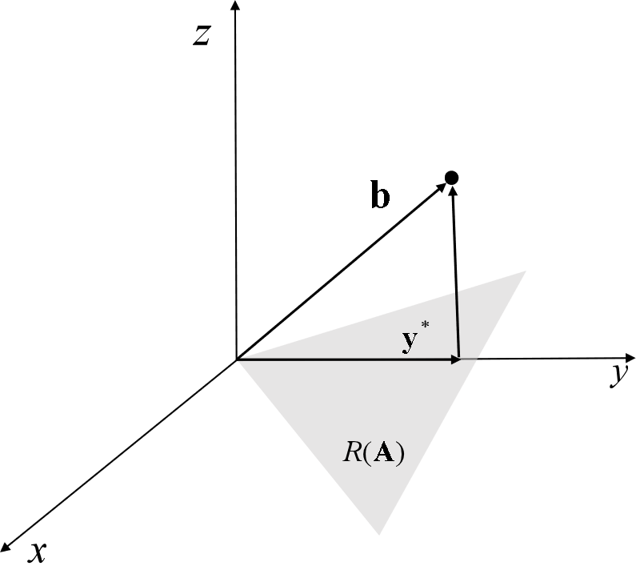

# The Vector Space and $\mathcal{R}^{n}$ #

[TOC]

## Vector Space ##

> *Def.* **Vector Space**
>
> A set of elements $V$ is said to be a **vector space** over a scalar field $S$ if:
>
> 1. An addition operation is defined between any two elements in $V$.
> 2. A scalar multiplication operation is defined between any elements of $S$ and any vector in $V$.
> 3. For any $\mathbf{u}, \mathbf{v}, \mathbf{w}\in V$ and any $a, b\in S$, these 10 properties must hold.
>    1. Closure Properties:
>       1. $(\mathbf{u} + \mathbf{v}) \in V$.
>       2. $a\mathbf{v}\in V$.
>    2. Properties of addition:
>       1. $\mathbf{u} + \mathbf{v}=\mathbf{v} + \mathbf{u}$.
>       2. $\mathbf{u} + (\mathbf{v} + \mathbf{w}) = (\mathbf{u} + \mathbf{v}) + \mathbf{w}$.
>       3. $\exist\ \mathbf{\theta} \in V,\ s.t.\ \forall\ \mathbf{v}\in V,\ \mathbf{v}+\mathbf{\theta}=\mathbf{v}$.
>       4. $\forall\ \mathbf{v}\in V, \exist\ -\mathbf{v}\in V, s.t.\ \mathbf{v} + (-\mathbf{v})=\mathbf{\theta}$.
>    3. Properties of scalar multiplication:
>       1. $a(b\mathbf{v}) = (ab)\mathbf{v}$.
>       2. $a(\mathbf{u} + \mathbf{v}) = a\mathbf{u} + a\mathbf{v}$.
>       3. $(a+b)\mathbf{v} = a\mathbf{v} + b\mathbf{v}$.
>       4. $\forall \mathbf{v}\in V,\ 1\mathbf{v} = \mathbf{v}$.
>
> *Note.* When the set of scalars $S$ is the set of real numbers, $V$ is called a **real vector space**.

> *Th.* **Cancellation Laws for Vector Addition**
>
> Let $V$ be a vector space, and let $\mathbf{u}, \mathbf{v}$ and $\mathbf{w}$ be vectors in $V$:
>
> 1. If $\mathbf{u} + \mathbf{v} = \mathbf{u} + \mathbf{w}$, then $\mathbf{v} = \mathbf{w}$.
> 2. If $\mathbf{v} + \mathbf{u} = \mathbf{w}  + \mathbf{u}$, then $\mathbf{v} = \mathbf{w}$.

> *Th.* If $V$ is a vector space, then:
>
> 1. The zero vector, $\mathbf{\theta}$, is unique.
> 2. For each $\mathbf{v}$, the additive inverse $-\mathbf{v}$ is unique.
> 3. $\forall\ \mathbf{v}\in V,\ 0\mathbf{v} = \mathbf{\theta}$, where 0 is the zero scalar.
> 4. $a\mathbf{\theta} = \mathbf{\theta}$ for every scalar $a$.
> 5. If $a\mathbf{v} = \mathbf{\theta}$, then $a=0$ or $\mathbf{v} = \mathbf{\theta}$.
> 6. $(-1)\mathbf{v} = -\mathbf{v}$.

## Subspace ##

> *Def.* **Subspace**
>
> Let $W$ be a subset of a vector space $V$. Then $W$ is a **subspace** of $V$ if and only if:
>
> 1. The zero vector $\mathbf{\theta}$, of $V$ is in $W$. (or $W$ is not empty).
> 2. $\mathbf{u} + \mathbf{v} \in W$ if $\mathbf{u}\in W$ and $\mathbf{v}\in W$.
> 3. $\forall\ a\in S \text{ and } \forall\ \mathbf{u}\in W\text{ we have }a\mathbf{u}\in W$.

> *Def.* **Span**
>
> If $Q=\{ \mathbf{v}_{1},\mathbf{v}_{2},\cdots, \mathbf{v}_{m} \}$ is a set of vectors in a vector space $V$, then the **span** of Q, denoted $Sp(Q)$, is the set of all linear combinations of vectors in $Q$, or:
> $$
> Sp(Q)=\{ \mathbf{v}|\mathbf{v}=a_{1}\mathbf{v}_{1} + \cdots + a_{m}\mathbf{v}_{m} \}
> $$
>

> *Def.* **Spanning Set**
>
> Let $V$ be a vector space, and let $Q=\{ \mathbf{v}_{1},\mathbf{v}_{2},\cdots, \mathbf{v}_{m} \}$ be a set of vectors in $V$. If every vector $\mathbf{v}\in V$ is a linear is a linear combination of vectors in $Q$, i.e.:
> $$
> \mathbf{v} = a_{1}\mathbf{v}_{1} + a_{2}\mathbf{v}_{2} + \cdots + a_{m}\mathbf{v}_{m},
> $$
> then we say that $Q$ is a **spanning set** for $V$.

> *Th.* If $V$ is a vector space and $Q=\{ \mathbf{v}_{1},\mathbf{v}_{2},\cdots, \mathbf{v}_{k} \}$ is a set of vectors in $V$, then $Sp(Q)$ is a subspace of $V$. And $Sp(Q)$ is also called the **subspace spanned by Q**.

> *Def.* **Minimal Spanning  Sets**
>
> A linearly independent spanning set is a minimal spanning set.

> *Def.* **Null Space of a Matrix**
>
> Let $A$ be an $(m\times n)$ matrix. The **null space** of A [denoted $\mathcal{N}(A)$] is the set of vectors in $R^{n}$ defined by:
> $$
> \mathcal{N}(A) = \{ \mathbf{x}|A\mathbf{x} = \mathbf{\theta},\ \mathbf{x}\in R^{n} \}
> $$
>
> *Th.* If $A$ is an $(m\times n)$ matrix, then $\mathcal{N}(A)$ is a subspace of $R^{n}$.

> *Def.* **Range of a Matrix (or Column Space of a Matrix)**
>
> Let $A$ be an $(m\times n)$ matrix. The **range** of $A$ [denoted $\mathcal{R}(A)$] is the set of vectors in $R^{m}$ defined by:
> $$
> \mathcal{R}(A) = \{ \mathbf{y}|\mathbf{y}=A\mathbf{x}\ \text{for some } \mathbf{x}\text{ in } R^{n} \}
> $$
> In a words, the range of $A$ consists of the set of all vectors $\mathbf{y} \in R^{m}$ s.t. the linear system $A\mathbf{x}=\mathbf{y}$ is consistent.
>
> *Note.* $\mathcal{R}(A) = Sp(\{ \mathbf{A}_{1}, \cdots, \mathbf{A}_{n} \})$.
>
> *Th.* If $A$ is an $(m\times n)$ matrix and if $\mathcal{R}(A)$ is the range of $A$, then $\mathcal{R}(A)$ is a subspace of $R^{m}$.

> *Def.* **Row Space of a Matrix**
>
> Let $A$ be an $(m\times n)$ matrix. The **row space** of $A$ is defined to be $\mathcal{R}(A^{T})$
>
> *Th.* Let $A$ be an $(m\times n)$ matrix, and suppose that $A$ is row equivalent to the $(m\times n)$ matrix $B$. Then $A$ and $B$ have the same row space.
>
> *Th.* If the nonzero matrix $A$ is row equivalent to the matrix $B$ in echelon form, then the nonzero rows of $B$ form a basis for the row space of $A$.

## Basis(Bases) ##

> *Def.* **Basis**
>
> Let $V$ be a vector space, and let $B=\{ \mathbf{v}_{1},\mathbf{v}_{2},\cdots, \mathbf{v}_{p} \}$ be a spanning set for $V$. If $B$ is linearly independent, then $B$ is a **basis** for $V$.
>
> i.e.: Basis is minimal spanning set.
>
> *Th.* All bases of same vector space have same number of vectors.

> *Th.* Let $W$ be a vector space, and let $B = \{ \mathbf{w}_{1}, \mathbf{w}_{2}, \cdots, \mathbf{w}_{p} \}$ be a spanning set for $W$ containing $p$ vectors. Then any set of $p+1$ or more vectors in $W$ is linearly dependent.

> *Def.* **Dimension**
>
> Let $V$ be a vector space.
>
> 1. If $V$ has a basis $B = \{ \mathbf{v}_{1}, \mathbf{v}_{2}, \cdots, \mathbf{v}_{n} \}$ of $n$ vectors, then $V$ has **dimension** $n$, and we write $dim(V) = n$. If $V=\{\theta\}$, then $dim(V) = 0$.
> 2. If $V$ is nontrivial and does not have a basis containing a finite number of vectors, then $V$ is an **infinite-dimensional** vector space.

> *Th.* The $V$ be a vector space, and let $Q=\{ \mathbf{u}_{1},\mathbf{u}_{2},\cdots,\mathbf{u}_{p} \}$ be a spanning set for $V$. Then there is a subset $Q^{'}$ of $Q$ that is a basis of $V$.

> *Th.* Let $V$ be a finite-dimensional vector space with $dim(V) = p$.
>
> 1. Any set of $p+1$ or more vectors in $V$ is linearly dependent.
> 2. Any spanning set for $V$ must contain at least $p$ vectors.
> 3. Any set of $p$ linearly independent vectors in $V$ is a basis for $V$.
> 4. Any set of $p$ vectors that spans $V$ is a basis for $V$.

> *Def.* **Coordinate**
>
> Given a vector space $V$ and its basis $B = \{ \mathbf{v}_{1},  \mathbf{v}_{2}, \cdots, \mathbf{v}_{p} \}$, for any vector $\mathbf{v} \in V$, we have
> $$
> \mathbf{v} = w_{1}\mathbf{v}_{1} + w_{2}\mathbf{v}_{2} + \cdots + w_{p}\mathbf{v}_{p}
> $$
> or
> $$
> [\mathbf{v}]_{B} =
> \begin{bmatrix}
> w_1 \\
> w_2 \\
> \vdots \\
> w_{p}
> \end{bmatrix}
> $$
> We will call the unique scalars $w_1, w_2, \cdots, w_p$ the **coordinates** of $\mathbf{v}$ with respect to the basis $B$, and $[\mathbf{v}]_B$ the **coordinate vector** of $\mathbf{v}$ with respect to $B$.

> *Lemma.* Let $V$ be a vector space with basis $B = \{ \mathbf{v}_{1},  \mathbf{v}_{2}, \cdots, \mathbf{v}_{p} \}$. If $\mathbf{u}$ and $\mathbf{v}$ are vectors in $V$ and if $c$ if a scalar, then the following hold:
>
> 1. $[\mathbf{u} + \mathbf{v}]_{B} = [\mathbf{u}]_{B} + [\mathbf{v}]_{B}$.
> 2. $[c\mathbf{u}]_{B} = c[\mathbf{u}]_{B}$.

> *Th.* Let $V$ be a vector space with basis $B = \{ \mathbf{v}_{1},  \mathbf{v}_{2}, \cdots, \mathbf{v}_{p} \}$. Let $S = \{ \mathbf{u}_{1},  \mathbf{u}_{2}, \cdots, \mathbf{u}_{m} \}$ be a subset of $V$, let $T=\{ [\mathbf{u}_{1}]_{B}, [\mathbf{u}_{2}]_{B}, \cdots, [\mathbf{u}_{m}]_{B} \}$.
>
> 1. A vector $\mathbf{u}\in V$ is in $Sp(S)$ if and only if $[\mathbf{u}]_{B}\in T$.
> 2. The set $S$ is linearly independent in $V$ if and only if the set $T$ is linearly independent in $R^p$.
>
> *Corollary.* $S$ is a basis for $V$ if and only if $T$ is a basis for $R^p$.

> *Def.* **Nullity of a Matrix**
>
> For a $(m\times n)$ matrix $A$, the dimension of the null space is called the the **nullity** of $A$.

> *Def.* **Rank of a Matrix**
>
> For a $(m\times n)$ matrix $A$, the dimension of the range of $A$ is called the **rank** of $A$. i.e. the rank of matrix $A$ is the dimension of column space of $A$: 
> $$
> \text{rank}(A) = \text{dim}(Sp(\{ \mathbf{A}_{1}, \mathbf{A}_{2}, \cdots, \mathbf{A}_{n} \})) = \text{dim}(\mathcal{R}(A))
> $$
> 

> *Th.* If $A$ is an $(m\times n)$ matrix, we have $\text{rank}(A) = \text{rank}(A^{T})$.
>
> *Corollary.*: If $A$ is an $(m\times n)$ matrix, then the row space and the column space of $A$ have the same dimension.
>
> *Th.* If $A$ is an $(m\times n)$ matrix, then $n = \text{rank}(A) + \text{nullity}(A)$.

> *Th.*  An $(m\times n)$ system of linear equations, $A\mathbf{x} = \mathbf{b}$, is consistent if and only if $\text{rank}(A) = \text{rank}([A|\mathbf{b}])$.

> *Th.* An $(n\times n)$ matrix $A$ is nonsingular if and only if $\text{rank}(A)=n$.

## Inner Product Space ##

> *Def.* **Inner Product**
>
> An **Inner Product** on a real vector space $V$ is a function that assigns a real number, $\langle \mathbf{u}, \mathbf{v} \rangle$, to each pair of vectors $\mathbf{v}$ and $\mathbf{u}$ is $V$, and that s.t. these properties:
>
> 1. $\langle \mathbf{u}, \mathbf{u} \rangle \geq 0$ and $\langle \mathbf{u}, \mathbf{u} \rangle=0 \Leftrightarrow \mathbf{u}=\mathbf{\theta}$.
> 2. $\langle \mathbf{u}, \mathbf{v} \rangle=\langle \mathbf{v}, \mathbf{u} \rangle$.
> 3. $\langle a\mathbf{u}, \mathbf{v} \rangle=a\langle \mathbf{u}, \mathbf{v} \rangle$.
> 4. $\langle \mathbf{u}, \mathbf{v}+\mathbf{w} \rangle = \langle \mathbf{u}, \mathbf{v} \rangle + \langle \mathbf{u}, \mathbf{w} \rangle$.

> *Th.* The operation $\langle \mathbf{u}, \mathbf{v} \rangle=\mathbf{u}^{T}A\mathbf{v}$ is an valid inner product for $\mathcal{R}^{n}$ if and only if $A$ is symmetric positive-definite matrix.

> *Def.* **Inner Product Space**
>
> We call a **vector space** with an inner product is an **inner-product space**.

> *Def.* **Norm**
>
> If $V$ is an inner-product space, then for each $\mathbf{v} \in V$ we define $\|\mathbf{v}\|=\sqrt{\langle \mathbf{v}, \mathbf{v} \rangle}$ the **norm** of $\mathbf{v}$.

> *Def.* **Orthogonal**
>
> If $\mathbf{u}$ and $\mathbf{v}$ are vectors in an inner-product space $V$, we say these two vectors are **orthogonal** if $\langle \mathbf{u}, \mathbf{v} \rangle=0$.

> *Def.* **Orthogonal Set**
>
> Vector set $B = \{ \mathbf{v}_{1}, \mathbf{v}_{2}, \cdots ,\mathbf{v}_{p} \}$ is an **orthogonal set** in inner-product space $V$ if $\forall i\neq j,\ \mathbf{v}_{i}\in B,\ \mathbf{v}_{j}\in B,\ s.t.\ \langle \mathbf{v}_{j}, \mathbf{v}_{i} \rangle=0$.

> *Def.* **Orthogonal Basis**
>
> If an orthogonal set of vectors $B$ is a basis for inner-product space $V$, we call $B$ an **orthogonal basis** for $V$. 
>
> Furthermore, if $\forall \mathbf{u}\in B,\ \| \mathbf{u} \|=1$, then $B$ is said to be an **orthonormal basis** for $V$.

> *Th.* In $\mathcal{R}^{n}$, let $S=\{ \mathbf{u}_1 , \mathbf{u}_{2}, \cdots , \mathbf{u}_{p} \}$ be a set of vectors in $\mathcal{R}^n$ and $\forall\ i,\ \mathbf{u}_{i}\neq \mathbf{\theta}$. If $S$ is an orthogonal set of vectors, then $S$ is a linearly independent set of vectors.
>
> *Proof.*
>
> Suppose $\sum_{i}c_i\mathbf{u}_i = \theta$, then for any $j$, we have $\sum_{i}c_i\mathbf{u}_j^T\mathbf{u}_i = c_j\mathbf{u}_j^T\mathbf{u}_j = \theta$. So $c_j = 0$ because $\mathbf{u_j} \neq \theta$.
>
> *Corollary.* Let $W$ be a subspace of $\mathcal{R}^n$, where $\text{dim}(W) = p$. If $S$ is an orthogonal set of $p$ **nonzero** vectors and is also a subset of $W$, then $S$ is an orthogonal basis for $W$.

> *Th.* **Coordinate**
>
> Let $B=\{ \mathbf{v}_{1}, \mathbf{v}_{2}, \cdots, \mathbf{v}_{n} \}$ be an orthogonal basis for an inner-product space $V$. If $\mathbf{u}$ is any vector in $V$, we have:
> $$
> \mathbf{u} = \dfrac{\langle \mathbf{u}, \mathbf{v}_{1} \rangle}{\langle \mathbf{v}_{1}, \mathbf{v}_{1} \rangle}\mathbf{v}_{1} + \dfrac{\langle \mathbf{u}, \mathbf{v}_{2} \rangle}{\langle \mathbf{v}_{2}, \mathbf{v}_{2} \rangle}\mathbf{v}_{2} + \cdots + \dfrac{\langle \mathbf{u}, \mathbf{v}_{n} \rangle}{\langle \mathbf{v}_{n}, \mathbf{v}_{n} \rangle}\mathbf{v}_{n}
> $$

> *Th.* **Gram-Schmidt Orthogonalization**
>
> [*Used for constructing an orthogonal basis*]
>
> Let $V$ be an inner-product space, and let $\{ \mathbf{u}_1 , \mathbf{u}_{2}, \cdots , \mathbf{u}_{p} \}$ be any basis for $V$. Let $\mathbf{v}_{1} = \mathbf{u}_{1}$, and other vectors defined by:
> $$
> \mathbf{v}_{k} = \mathbf{u}_{k} - \sum_{j=1}^{k-1}\dfrac{\langle \mathbf{u}_{k}, \mathbf{v}_{j} \rangle}{\langle \mathbf{v}_{j}, \mathbf{v}_{j} \rangle}\mathbf{v}_{j}
> $$
> Then $\{ \mathbf{v}_1 , \mathbf{v}_{2}, \cdots , \mathbf{v}_{p} \}$ is an orthogonal basis for $V$.

## Least-Squares Solutions to Inconsistent Systems ##

If $A\mathbf{x} = \mathbf{b}$ is inconsistent. We want to find a approximating solution.

> *Def.* **Overdetermined Systems**
>
> A linear system with more equations than unknowns is called **overdetermined systems**.

> *Def.* **Residual Vector and Least-square Solution**
>
> Consider the linear system $A\mathbf{x} = \mathbf{b}$ where $A$ is $(m\times n)$. If $x$ is a vector in $R^n$, then the vector $\mathbf{r} = A\mathbf{x} - \mathbf{b}$ is called a **residual vector**. A vector $\mathbf{x}^{*}\in R^n$ that yields the smallest possible residual vector is called a least-squares solution to $A\mathbf{x} = \mathbf{b}$. Or $\mathbf{x}^{*}$ is a **least-squares solution** to $A\mathbf{x} = \mathbf{b}$ if 
> $$
> \| A\mathbf{x}^{*} - \mathbf{b} \| \leq \| A\mathbf{x} - \mathbf{b} \|,\ \text{ for all }\mathbf{x}\in R^{n}
> $$

Consider a special case of an inconsistent $(3\times 2)$ system $A\mathbf{x} = \mathbf{b}$ suggests how we can calculate least-squares solutions. In particular, consider figure below with illustrates a vector $\mathbf{b}$ that is not in $\mathcal{R}(A)$.

Let the vector $\mathbf{y}^{*}$ in $\mathcal{R}(A)$ be the closest vector in $\mathcal{R}(A)$ to $\mathbf{b}$, we have:
$$
\| \mathbf{y}^{*} - \mathbf{b} \| \leq \| \mathbf{y} - \mathbf{b} \|,\ \text{ for all }\mathbf{y}\in\mathcal{R}(A)
$$
Geometry suggests that the vector $\mathbf{y}^{*} - \mathbf{b}$ is orthogonal to any vector in $\mathcal{R}(A)$. I.e.: for any column vector $\mathbf{A}_{i}$ of $A$. we have:
$$
\mathbf{A}_{i}^{T}(\mathbf{y}^{*} - \mathbf{b}) = 0
$$
Or in matrix-vector terms,
$$
A^{T}(\mathbf{y}^{*} - \mathbf{b}) = \mathbf{\theta}
$$
 Since $\mathbf{y}^{*} = A\mathbf{x}^*$, we have:
$$
A^{T}A\mathbf{x}^{*} = A^{T}\mathbf{b}
$$

> *Th.* Consider the $(m\times n)$ system $A\mathbf{x} = \mathbf{b}$:
>
> 1. The associated system $A^{T}A\mathbf{x} = A^{T}\mathbf{b}$, which is called the **normal equations**, is always consistent.
> 2. The least-squares solutions of $A\mathbf{x} = \mathbf{b}$ are precisely the solutions of $A^{T}A\mathbf{x} = A^{T}\mathbf{b}$.
> 3. The least-squares solution is unique if and only if $A$ has rank $n$. If $rank(A) < n$, we say that $A$ is **rank deficient** and may have infinitely many solutions.

### Least-Squares Fits to Data ###

> *Def.* **Least-squares Criterion**
>
> 1. **Best Least-squares Linear Fit**: Find $m$ and $c$ to minimize $\sum_{i=0}^{n}[(mt_{i} + c) - y_{i}]^{2}$.
> 2. **Best Least-squares Quadratic Fit**: Find $a,b,c$ to minimize $\sum_{i=0}^{n}[(at^{2}_{i} + bt_{i} + c) - y_{i}]^{2}$.

Consider the following table of data:

| $\mathbf{t}$ | $t_{0}$ | $t_{1}$ | $t_{2}$ | $\cdots$ | $t_{m}$ |
| ------------ | ------- | ------- | ------- | -------- | ------- |
| $\mathbf{y}$ | $y_{0}$ | $y_{1}$ | $y_{2}$ | $\cdots$ | $y_{m}$ |

Suppose we decide to fit these data with an $n$-th degree polynomial:
$$
p(t) = a_{n}t^n + a_{n-1}t^{n-1} + \cdots + a_{1}t + a_{0}
$$
We want to minimize
$$
Q(a_{0}, a_{1}, \cdots, a_{n}) = \sum_{i=0}^{m}[p(t_{i}) - y_{i}]^2
$$
Let 
$$
A = 
\begin{bmatrix}
1		&	t_{0}	&	t_{0}^{2}	&	\cdots	&	t_{0}^{n} \\
1		&	t_{1}	&	t_{1}^{2}	&	\cdots	&	t_{1}^{n} \\
\vdots	&	~		&	~			&	~		&	\vdots \\
1		&	t_{m}	&	t_{m}^{2}	&	\cdots	&	t_{m}^{n}
\end{bmatrix},\ 
\mathbf{x} = 
\begin{bmatrix}
a_0 \\
a_1 \\
\vdots \\
a_n
\end{bmatrix},\ 
\mathbf{b} = 
\begin{bmatrix}
y_0 \\
y_1 \\
\vdots \\
y_m
\end{bmatrix}.
$$
We have
$$
Q(a_{0}, a_{1}, \cdots, a_{n}) = \| A\mathbf{x} - \mathbf{b} \|^2
$$
As before, we can minimize this by solving $A^{T}A\mathbf{x} = A^{T}\mathbf{b}$.

### Theory of Least Squares ###

> *Def.* **The Least-Squares Problem in $R^n$**
>
> Let $W$ be a $p$-dim subspace of $R^n$. Given a vector $\mathbf{v}\in R^n$, find a vector $\mathbf{w}^{*}\in W,\ s.t.\ $:
> $$
> \| \mathbf{v} - \mathbf{w}^{*} \| \leq \| \mathbf{v} - \mathbf{w} \|,\ \forall\ \mathbf{w} \in W.
> $$
> The vector $\mathbf{w}^*$ is called the **best least-squares approximation** of $\mathbf{v}$.

> *Th.* Let $W$ be a $p$-dim subspace of $R^n$, and let $\mathbf{v}$ be a vector in $R^n$. Suppose there is a vector $\mathbf{w}^*$ such that $(\mathbf{v} - \mathbf{w}^{*})^{T}\mathbf{w} = 0$ for every vector $\mathbf{w}$ in $W$. Then $\mathbf{w}^*$ is the best least-squares approximation of $\mathbf{v}$.

> *Th.* Let $W$ be a $p$-dim subspace of $R^n$, and let $\{ \mathbf{u}_{1},  \mathbf{u}_{2}, \cdots , \mathbf{u}_{p} \}$ be a basis for $W$. Let $\mathbf{v}$ be a vector in $R^n$. Then $(\mathbf{v} - \mathbf{w}^{*})^{T}\mathbf{w}=0$ for all $\mathbf{w}\in W$ if and only if:
> $$
> (\mathbf{v} - \mathbf{w}^{*})^{T}\mathbf{u}_{i} = 0,\ 1\leq i \leq p.
> $$

> *Th.* Let $W$ be a $p$-dim subspace of $R^n$, and let $\mathbf{v}$ be a vector in $R^n$. Then there is **one and only one** best least-squares approximation in $W$ to $\mathbf{v}$. And if we have an orthogonal basis $\{ \mathbf{u}_{1},  \mathbf{u}_{2}, \cdots , \mathbf{u}_{p} \}$ for $W$, then:
> $$
> \mathbf{w}^{*} = \sum_{i=1}^{p}\dfrac{\mathbf{v}^{T}\mathbf{u}_{i}}{\mathbf{u}_{i}^{T}\mathbf{u}_{i}}\mathbf{u}_{i}
> $$

## Orthogonal Projections ##

> *Def.* **Projections**
>
> Let $V$ be an inner-product space and let $W$ be a subspace of $V$. Given a vector $\mathbf{v}$ in $V$, if there exist a vector $\mathbf{w}^* \in W\ s.t.$ $\| \mathbf{v} - \mathbf{w}^{*} \| \leq \| \mathbf{v} - \mathbf{w} \|\ \forall\ \mathbf{w} \in W$. We say that $\mathbf{w}^*$ is the **projection** of $\mathbf{v}$ onto $W$, or (frequently) **the best least-squares approximation** to $\mathbf{v}$.

> *Th.* Let $V$ be an inner-product space and let $W$ be a subspace of $V$. Let $\mathbf{v}$ be a vector in $V$, and suppose $\mathbf{w}^*$ is a vector in $W$ such that:
> $$
> \langle \mathbf{v} - \mathbf{w}^*, \mathbf{w} \rangle = 0,\ \forall\ \mathbf{w}\in W.
> $$
> Then we have $\| \mathbf{v} - \mathbf{w}^{*} \| \leq \| \mathbf{v} - \mathbf{w} \|\ \forall\ \mathbf{w} \in W$ with equality holding only for $\mathbf{w} = \mathbf{w}^*$.

> *Th.* Let $V$ be an inner-product space, and let $\mathbf{v}$ be a vector in $V$. Let $W$ be an $n$-dimensional subspace of $V$, and let $\{ \mathbf{u}_{1}, \mathbf{u}_{2}, \cdots, \mathbf{u}_{n} \}$ be an **orthogonal** basis for $W$. Then
> $$
> \| \mathbf{v} - \mathbf{w}^* \| \leq \| \mathbf{v} - \mathbf{w} \|,\ \forall\ \mathbf{w}\in W.
> $$
> hold if and only if 
> $$
> \mathbf{w}^* = \dfrac{\langle \mathbf{v},\mathbf{u}_{1} \rangle}{\langle \mathbf{u}_{1}, \mathbf{u}_{1} \rangle}\mathbf{u}_{1} + \dfrac{\langle \mathbf{v},\mathbf{u}_{2} \rangle}{\langle \mathbf{u}_{2}, \mathbf{u}_{2} \rangle}\mathbf{u}_{2} + \cdots + \dfrac{\langle \mathbf{v},\mathbf{u}_{n} \rangle}{\langle \mathbf{u}_{n}, \mathbf{u}_{n} \rangle}\mathbf{u}_{n}
> $$
>