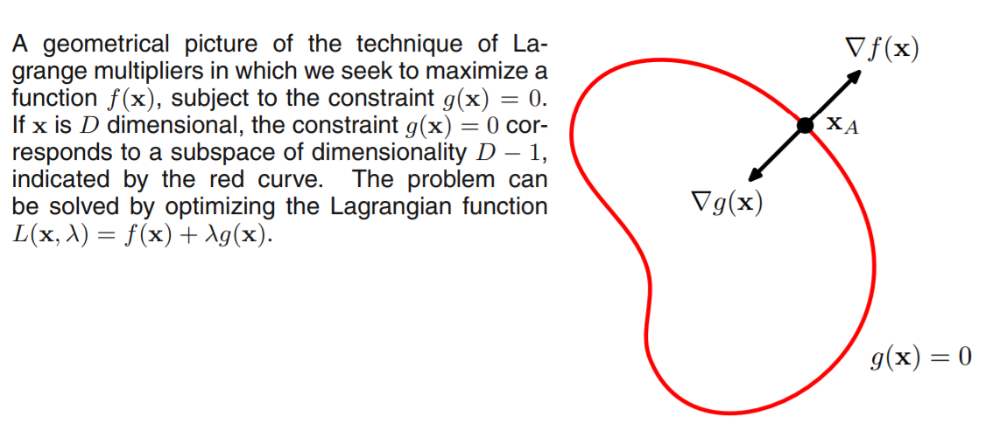
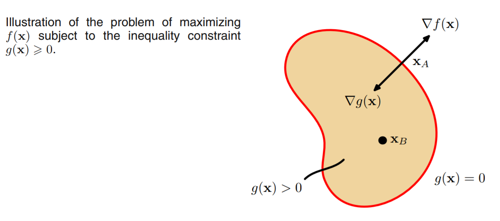

# Lagrange Multipliers

[TOC]

Lagrange multipliers, a.k.a. undetermined multipliers, are used to find **the stationary points** of a function of several variables subject to one or more constraints.

## Equality Constraint

Sometime it may be difficult to find a analytic solution of the constraint between variables $x_i$. We can introduce a parameter $\lambda$ called Lagrange multiplier. From a geometrical perspective, consider a $D$-dimensional variable $\mathbb{x} = (x_1, \dots, x_D)^T$. The constraint equation $g(\mathbb{x})=0$ is a $(D-1)$-dimensional surface in $\mathbb{x}$-space.

> *Lemma-1*. At any point on the surface $g(\mathbb{x}) = 0$ the gradient $\nabla g$ will be orthogonal to the surface.
>
> *Proof*. Consider a point $\mathbb{x}$ on the surface, and consider a nearby point $\mathbb{x}+\mathbb{\epsilon}$ that also on the surface. If we make a Taylor expansion around this point, we have:
> $$
> g(\mathbb{x} + \mathbb{\epsilon}) \approx g(\mathbb{x}) + \mathbb{\epsilon}^T\nabla g(\mathbb{x})
> $$
> because $g(\mathbb{x} + \mathbb{\epsilon}) = g(\mathbb{x})$, we have $\mathbb{\epsilon}^T\nabla g(\mathbb{x}) \approx 0$. And if $\|\mathbb{\epsilon}\| \rightarrow 0$, we have $\mathbb{\epsilon}^T\nabla g(\mathbb{x}) = 0$. And because at this time $\mathbb{\epsilon}$ is parallel to the surface $g(\mathbb{x})=0$, so $\nabla g$ is normal to the surface.

> *Lemma-2.* If $\mathbb{x}^*$ on $g(\mathbb{x})=0$ and $\forall \mathbb{x}$ on $g(\mathbb{x})=0$, we have $f(\mathbb{x}^*) \geq f(\mathbb{x})$, then $\nabla f(\mathbb{x}^*)$ is orthogonal to the surface $g(\mathbb{x})=0$.
>
> *Proof*. Otherwise we could increase the value of $f(\mathbb{x})$ by moving a short distance along the surface.

From *Lemma-1* and *Lemma-2* we have:
$$
\nabla f + \lambda \nabla g = 0
$$
where $\lambda \neq 0$ is the Lagrange multiplier.

Then we can define the *Lagrangian* function
$$
L(\mathbb{x}, \lambda) := f(\mathbb{x}) + \lambda g(\mathbb{x})
$$
And
$$
\begin{split}
\nabla_\mathbb{x}L = 0 & \Rightarrow & \nabla f + \lambda \nabla g = 0 \\
\frac{\partial L}{\partial \lambda} = 0 & \Rightarrow & g(\mathbb{x}) = 0
\end{split}
$$
Thus to find the maximum of $f$ s.t. $g(\mathbb{x}) = 0$, we solve the equation
$$
\left\{\begin{matrix} \nabla_\mathbb{x}L = 0 & \Rightarrow & \nabla f + \lambda \nabla g = 0 \\
\frac{\partial L}{\partial \lambda} = 0 & \Rightarrow & g(\mathbb{x}) = 0 \end{matrix}\right.
$$
and get a $(D+1)$-dimension equations to get stationary points.

## Inequality Constraint

The problem of maximizing $f$ with inequality constraint of the form $g(\mathbb{x}) \geq 0$.

There are two kinds of solution possible.

* *inactive* constraint: The stationary point lies in the region $g(\mathbb{x}) > 0$. The function $g(\mathbb{x})$ is useless, $\lambda = 0$.
* *active* constraint: The stationary point lies in the surface $g(\mathbb{x}) = 0$. This is analogous to the equality constraint case, $\lambda \neq 0$.

Note that now the sign of $\lambda$ is crucial, because $f$ only be at a maximum if its gradient is oriented away from the region $g(\mathbb{x}) > 0$ (At this time, the stationary point lies in the surface $g(x)=0$. So the points in the region must has value less then the stationary point lies in the surface, which means the direction of gradient is oriented away from the region). Therefore $\lambda > 0$ (if we want a minimum, we set $\lambda < 0$).

For either cases, we have $\lambda g(\mathbb{x}) = 0$. Then we can define:

> **KKT(Karush-Kuhn-Tucker) conditions**
> $$
> \begin{split}
> g(\mathbb{x}) & \geq &\  0 \\
> \lambda & \geq &\  0 \\
> \lambda g(\mathbb{x}) & = &\  0
> \end{split}
> $$

And the solution is also straightforward.